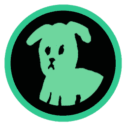
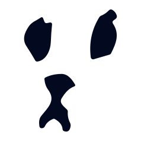
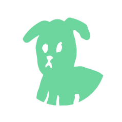

<h1 align="center">
    
</h1>
 
<h3 align="center">We are the OG grassroots incubator of NEAR. The best hangout place in entire web3.</h3>

---

# Shitzu Brand Kit

This repository contains the brand assets for Shitzu. The assets are free to use for any Shitzu related projects.

## Logo

| Preview                                              | File                               | Usage                 |
| ---------------------------------------------------- | ---------------------------------- | --------------------- |
|           | [webp](./logo/shitzu.webp)         | Shitzu Logo           |
|      | [png](./logo/meme-cooking.webp)     | Meme.Cooking Logo          |
|       | [svg](./logo/shitzu_face.svg)      | Shitzu Face Logo      |
|  | [svg](./logo/shitzu-wireframe.svg) | Shitzu Wireframe Logo |

## Color Palette

| Preview                                                  | Hexcode | Usage        |
| -------------------------------------------------------- | ------- | ------------ |
|  | #15b47f | Shitzu       |
|  | #00DC97 | Shitzu Light |
|  | #222222 | Dark         |
